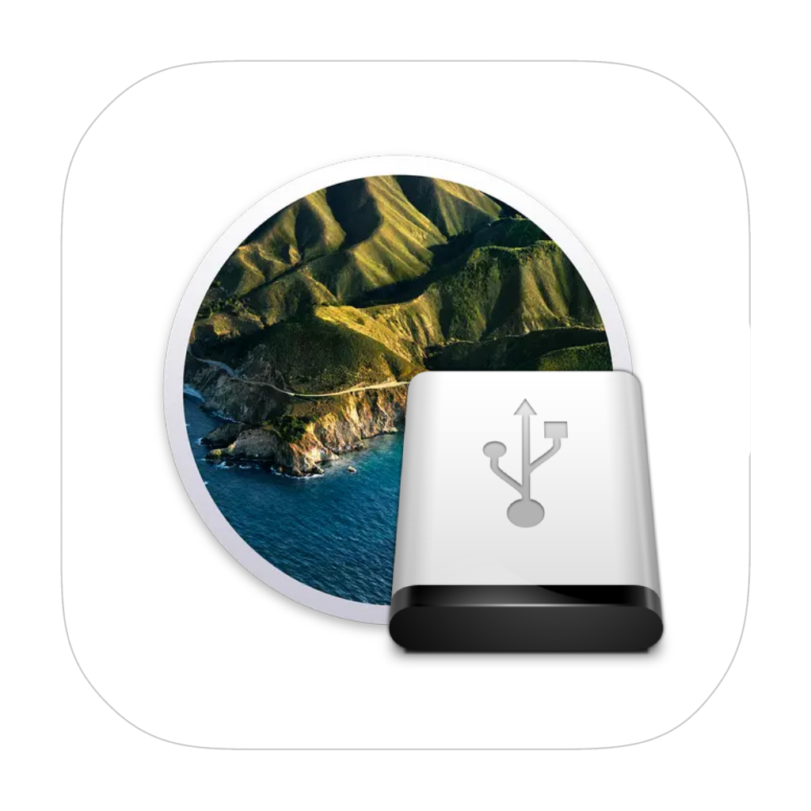

## OSXToUSB

## What is this?

Using this utility you can easily download macOS images and write them to a flash drive. The program has a user-friendly interface. Available for download are macOS versions from: OS X Mavericks to macOS Sequoia

## Requirements

1. curl
2. python3, pip3
3. Mac on Intel processor || on M1/M2/M3/M4 chip

## Installation

Run this command in terminal

```bash

curl --output install.sh https://zer0xdev.github.io/OSXToUSB/install.sh && sudo sh install.sh

```

The script will automatically download all additional components and launch the program.

## I don't understand how to run the program

If you close the program and want to start it again, just go to the osxtousb folder and type python3 main.py

```bash

cd osxtousb
python3 main.py

```

## How does this work?

You select the macOS installer (for example, Install macOS Mojave.app), then select the USB stick. After selecting the installer and USB stick, a command is generated to record the image. Each macOS installer has a createinstallmedia file in the /Contents/Resources/ folder, it is used to create the installation USB stick. The program generates a command and then executes it. It's that simple!


